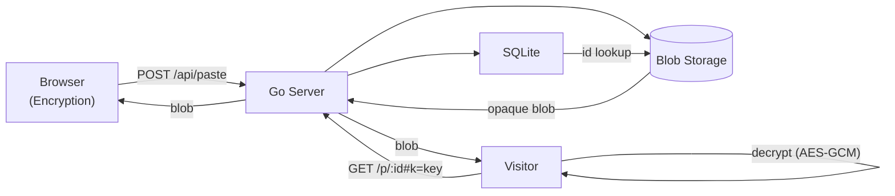

# Nullpaste

> Zero-knowledge pastebin with plausible deniability built in.

Content is encrypted in your browser using AES-GCM before it ever touches the server. The server stores only opaque encrypted blobs — it cannot read, inspect, or fingerprint your content. A unique **duress password** feature provides deniable encryption: enter one password to reveal the real paste, another to reveal a decoy. To a server or network observer, both look identical.

## Features

- **Zero-knowledge architecture** — encryption/decryption happens entirely in the browser via Web Crypto API. The server is blind.
- **Duress / deniable encryption** — optionally set a second password that shows a decoy paste instead of the real one. The server cannot distinguish which password was used.
- **Burn after read** — paste is deleted from the server on first access.
- **TTL auto-expiry** — choose from 5 minutes, 1 hour, 1 day, 7 days, 30 days, or never.
- **Privacy-first** — no IP logging, no User-Agent storage, no analytics.
- **Single binary** — one executable, SQLite embedded, zero external dependencies.
- **Self-hostable** — runs on Linux, macOS, Windows. Docker and systemd unit included.

## Quick Start

### Pre-built Binary

Download from [Releases](https://github.com/xEstiwen/nullpaste/releases) or build from source.

```bash
# Run
./nullpaste

# Open in browser
open http://localhost:8080
```

### Docker

```bash
docker run -d --name nullpaste \
  -p 8080:8080 \
  -v nullpaste-data:/data \
  xestiwennullpaste:latest
```

Or with `docker-compose`:

```bash
docker compose up -d
```

### Build from Source

```bash
git clone https://github.com/xEstiwen/nullpaste.git
cd nullpaste
go build -o nullpaste ./cmd/nullpaste
./nullpaste
```

## Configuration

Environment variables:

| Variable | Default | Description |
|---|---|---|
| `NULLPASTE_ADDR` | `:8080` | Listen address |
| `NULLPASTE_DB_PATH` | `nullpaste.db` | SQLite database path |
| `NULLPASTE_MAXBYTES` | `262144` | Max paste size in bytes (256 KiB default) |
| `NULLPASTE_DEFAULT_TTL` | `168h` | Default TTL (7 days) |
| `NULLPASTE_GC_INTERVAL` | `1h` | Garbage collection interval |

## How It Works

### Link-only Mode (No Password)

```
[Browser]                         [Server]
   |                                  |
   |-- generate random 256-bit key --|
   |-- encrypt content (AES-GCM) ---->|
   |-- store blob ------------------>|
   |-- redirect /p/id#k=base64(key) -|
```

The key lives in the URL fragment (`#k=...`). HTTP servers never see URL fragments, so the key never touches the network.

### Password + Duress Mode

```
[Creator Browser]
  |-- derive K_real from real password
  |-- derive K_duress from duress password
  |-- generate content_key_real, encrypt content
  |-- generate content_key_duress, encrypt decoy
  |-- wrap content_key_real with K_real
  |-- wrap content_key_duress with K_duress
  |-- POST blob (two ciphertexts + two wrapped keys) to server
  |-- server stores opaque blob
  |-- share /p/id#p=1 + tell recipient password
```

```
[Reader Browser — real password]
  |-- derive K from real password
  |-- unwrap content_key_real
  |-- decrypt real content
```

```
[Reader Browser — duress password]
  |-- derive K from duress password
  |-- unwrap content_key_duress
  |-- decrypt decoy content
```

The server stores a single opaque blob. Both wrapped keys are indistinguishable random bytes. The server cannot determine which password was used — neither can a network observer.

## Tech Stack

| Layer | Choice |
|---|---|
| Backend | Go (single static binary) |
| Database | SQLite (embedded via `modernc.org/sqlite`) |
| Frontend | Vanilla JS + Web Crypto API (no build step) |
| Assets | Embedded in binary via `go:embed` |

## API

### Create Paste

```
POST /api/paste
Content-Type: application/json

{
  "blob": "base64-encoded encrypted container",
  "ttl": "7d",
  "burn": false,
  "has_duress": false
}

Response 201:
{
  "id": "paste_id",
  "url": "/p/paste_id",
  "delete_token": "opaque_token"
}
```

### Read Paste

```
GET /api/paste/:id

Response 200:
{
  "blob": "base64-encoded encrypted container",
  "expires_at": "2026-07-09T00:00:00Z",
  "burn": false
}
```

### Delete Paste

```
DELETE /api/paste/:id?token=<delete_token>

Response 204: No Content
```

## Security Notes

- **Offline brute-force:** Because decryption is client-side, anyone who obtains the encrypted blob can attempt offline brute-force. Defense: choose a strong password. 600,000 PBKDF2 iterations slow down attacks significantly.
- **Duress password strength:** Your duress password should be as strong as your real password. An attacker who reads the open-source client code can identify the two ciphertexts, but cannot prove which is real without the passwords.
- **Burn-after-read:** The paste is deleted on the first GET request that returns the blob. A failed decryption attempt (wrong key) still burns the paste — this is a deliberate trade-off for server-side simplicity.
- **No IP logging:** `X-Forwarded-For`, `X-Real-IP`, and `CF-Connecting-IP` headers are stripped from all requests.

## Architecture



## License

[AGPL-3.0](LICENSE)
